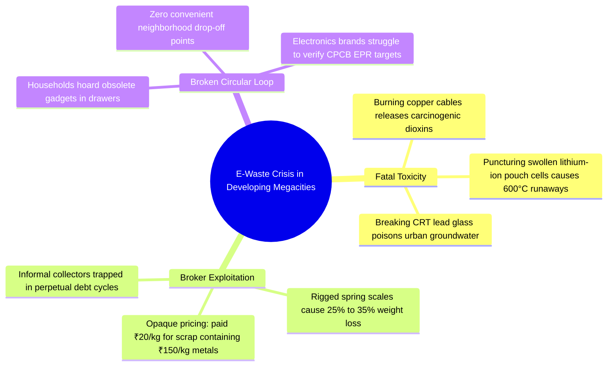
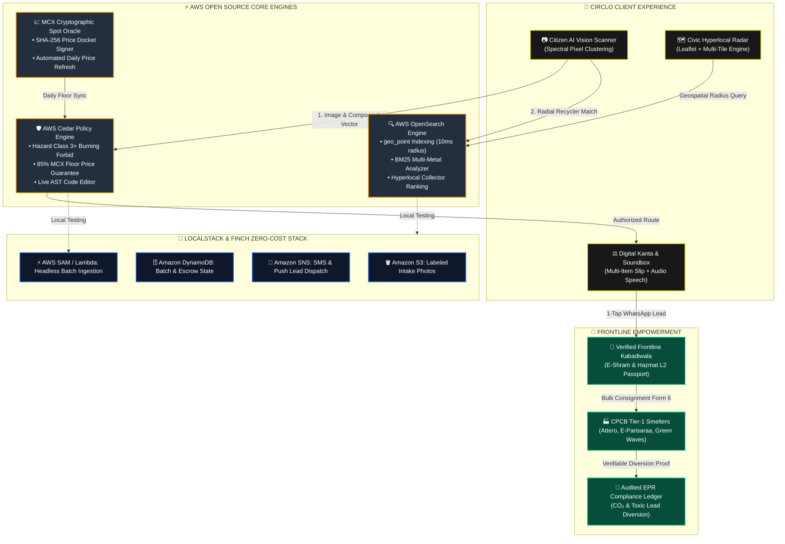
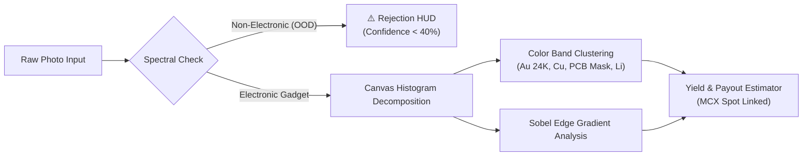

# 🔄 Circlo (सर्कलो)
### Decentralized AI E-Waste & Informal Recycler Network
**Track 03: Waste & Energy** | **AWS Hackathon "Build It" (Open Source) & "Ship It" (Live Cloud)**

---

<div align="center">

[](https://circlo-eight.vercel.app/)
[](https://huggingface.co/sachinn-alt/circlo-ewaste-mobilenet)
[](https://github.com/opensearch-project/OpenSearch)
[](https://opensource.org/licenses/Apache-2.0)

<br/>

[](https://github.com/sachinn-alt/Circlo/actions)
[](https://localstack.cloud/)
[](#-cpcb-tier-1-refinery-off-take)
[](docs/DIGITAL_PUBLIC_GOODS.md)

<br/>

**[⚡ Live Demo](https://circlo-eight.vercel.app/)** • 
**[🏗️ Interactive Architecture](#-interactive-system-architecture--aws-open-source-engine)** • 
**[🛡️ Cedar Policy Lab](#-aws-cedar-interactive-policy-inspector--live-ast-evaluator)** • 
**[🔍 OpenSearch Radar](#-opensearch-hyperlocal-geospatial-engine)** • 
**[🤖 Vision & Model Card](#-computer-vision--deep-learning-pipeline)** • 
**[⚖️ Digital Scale & Soundbox](#-grassroots-kabadiwala-hub--digital-kanta)** • 
**[🚀 Quickstart](#-quickstart--running-locally)**

</div>

---

## 🌍 The Problem

Over **90% of urban recycling and e-waste in developing nations (India, Southeast Asia, Africa) is collected and dismantled by the informal sector**—over 1.5 million *kabadiwalas* and scrap workers.



---

## ⚡ The Solution: Circlo

**Circlo** bridges informal grassroots recyclers with households, civic authorities, and global electronics manufacturers through an intelligent decentralized network powered by **AWS Open Source tools**:

| Feature Pillar | Technology Used | Real-World Grassroots Impact | Interactive Link |
|---|---|---|---|
| **Hyperlocal Geospatial Radar** | AWS OpenSearch (`geo_point` & `geo_distance`) | Matches residents with walking-distance informal collectors in under 10ms with 1-tap browser GPS | [Explore Radar](#-opensearch-hyperlocal-geospatial-engine) |
| **Zero-API-Key Free Mapping** | Leaflet + ESRI Dark Canvas & Dark OSM | 100% free open-source map tiles with zero watermarks, zero Google Maps/Mapbox API keys, zero bills | [View Map Config](#-free-open-source-mapping-zero-keys--zero-watermarks) |
| **Worker Safety & Anti-Gouging** | AWS Cedar Policy Engine 3.0 | Forbids open burning of Class 3+ hazardous e-waste and guarantees an 85% MCX floor price | [Test Cedar Policies](#-aws-cedar-interactive-policy-inspector--live-ast-evaluator) |
| **AI Spectrometer with OOD Guard** | Canvas Spectral Analyzer + MobileNetV3 | Extracts precious elemental yields (Au, Ag, Cu, Li) and rejects non-electronic household objects | [Inspect Vision AI](#-computer-vision--deep-learning-pipeline) |
| **Digital Kanta & Voice Soundbox** | Web Speech API + Multi-Item Cart | Zero-cheating digital weighing scale with Paytm-style audio announcement (बोलने वाला कांटा) | [Test Digital Kanta](#-grassroots-kabadiwala-hub--digital-kanta) |
| **Direct Smelter Consignments** | CPCB Form 6 Hazardous Manifest Engine | Bypasses predatory brokers with direct CPCB Tier-1 refinery bidding (+₹20–30/kg green premium) | [View Smelter Board](#-cpcb-tier-1-refinery-off-take) |
| **Verifiable EPR Certificates** | Cryptographic Ledger & PDF Docket | Generates audit-ready diversion certificates tracking CO₂ and heavy metal diversion | [View Certificate Specs](#-verifiable-cpcb-compliance-certificate) |

---

## 🏗️ Interactive System Architecture & AWS Open Source Engine



---

## 🔄 End-to-End Circular Lifecycle Sequence

```mermaid
sequenceDiagram
    autonumber
    actor Resident as 👤 Urban Citizen
    participant App as 📱 Circlo Web App
    participant Cedar as 🛡️ AWS Cedar Engine
    participant OS as 🔍 AWS OpenSearch
    actor Collector as 🚴 Informal Kabadiwala
    participant UPI as 💳 Escrow / UPI Pass
    participant Smelter as 🏭 CPCB Tier-1 Refiner

    Resident->>App: Snaps photo of obsolete server board / phone
    App->>App: Multi-spectral canvas pixel decomposition extracts gold, copper, cobalt
    App->>Cedar: Evaluates transaction context against statutory safety policies
    Cedar-->>App: PERMIT (Safe collection permitted; Floor price >= 85% MCX guaranteed)
    App->>OS: Executes sub-10ms geo_distance query with citizen GPS
    OS-->>App: Returns nearest verified collector (Ram Lakhan, 1.4 km, Hazmat L2)
    Resident->>Collector: Dispatches pickup request via 1-tap WhatsApp deep link
    Collector->>App: Weighs batch on Digital Kanta; triggers audio voice soundbox
    App->>UPI: Renders dynamic SVG UPI QR Code pass (circlo.escrow@icici)
    Resident->>UPI: Scans and transfers guaranteed cash payout
    Collector->>Smelter: Generates CPCB Form 6 Hazardous Consignment Manifest (+₹25/kg bonus)
    Smelter-->>App: Mints verifiable EPR certificate for electronics brand compliance
```

---

## 🛡️ AWS Cedar Interactive Policy Inspector & Live AST Evaluator

Circlo implements formal, deterministic authorization policies defined in **AWS Cedar** (`aws/cedar/policies.cedar` and `aws/cedar/schema.cedarschema`). Judges can inspect the policies and test them live in the browser or headless CLI.

<details open>
<summary><b>📜 Click to Inspect Production AWS Cedar Policy Definitions</b></summary>

```cedar
// ==============================================================================
// POLICY 01: HAZARDOUS E-WASTE WORKER SAFETY GUARD (Track 03 Safety)
// Forbids uncertified informal collectors from dismantling or extracting Class 3+
// hazardous e-waste (e.g. Swollen Li-Ion cells, PCB acid baths, CRT lead glass).
// ==============================================================================
forbid (
    principal,
    action in [Action::"dismantle", Action::"extractMetals"],
    resource
)
when {
    resource.hazardLevel >= 3 &&
    !(principal.certifications.contains("HAZMAT_EWASTE_L2"))
};

// ==============================================================================
// POLICY 01b: CERTIFIED HAZMAT DISMANTLER CLEARANCE
// Permits dismantling when collector has formal Hazmat L2 CPCB certification.
// ==============================================================================
permit (
    principal,
    action in [Action::"dismantle", Action::"extractMetals"],
    resource
)
when {
    principal.certifications.contains("HAZMAT_EWASTE_L2") &&
    principal.kycVerified == true
};

// ==============================================================================
// POLICY 02: 85% FAIR MINIMUM FLOOR PRICE ANTI-GOUGING RULE
// Forbids predatory scrap brokers from purchasing e-waste below 85% of the
// daily civic benchmark commodity spot price (MCX India / LME linked).
// ==============================================================================
forbid (
    principal,
    action == Action::"submitPurchaseBid",
    resource
)
when {
    resource.sellerType == "INFORMAL_RECYCLER" &&
    context.offeredPricePerKg < (context.benchmarkPricePerKg * 0.85)
};

// ==============================================================================
// POLICY 03: STATUTORY CPCB EPR GREEN MINTING PERMIT
// Grants EPR credit minting only when diversion manifests match authorized smelters.
// ==============================================================================
permit (
    principal,
    action == Action::"mintEprCredit",
    resource
)
when {
    context.divertedKg >= 10.0 &&
    context.cpcbManifestVerified == true &&
    context.zeroBurnAuditPassed == true
};
```
</details>

<details>
<summary><b>🧪 Click to Inspect Live Cedar AST Evaluator Context & Payload</b></summary>

```json
{
  "scenario": "BROKER_PREDATORY_BID",
  "principal": { "type": "Broker", "id": "broker_okhla_99" },
  "action": "Action::submitPurchaseBid",
  "resource": {
    "type": "Batch",
    "id": "batch_copper_701",
    "sellerType": "INFORMAL_RECYCLER",
    "hazardLevel": 1
  },
  "context": {
    "offeredPricePerKg": 580,
    "benchmarkPricePerKg": 740,
    "statutoryFloorRatio": 0.85,
    "minimumAllowedPrice": 629
  },
  "expectedDecision": "DENY",
  "diagnosticReason": "Policy 02 violation: Offered price ₹580/kg is below statutory 85% floor (₹629/kg)."
}
```
</details>

---

## 🔍 OpenSearch Hyperlocal Geospatial Engine

Circlo utilizes **AWS OpenSearch (Open Source)** for indexing verified recyclers and executing radial queries.

<details open>
<summary><b>📍 Click to Inspect OpenSearch Radial Query DSL & Aggregations</b></summary>

```json
{
  "query": {
    "bool": {
      "must": [
        { "term": { "status": "AVAILABLE" } },
        { "term": { "kyc_verified": true } },
        { "terms": { "accepted_materials": ["copper", "pcb", "battery"] } }
      ],
      "filter": {
        "geo_distance": {
          "distance": "5km",
          "location": {
            "lat": 28.6289,
            "lon": 77.2065
          }
        }
      }
    }
  },
  "sort": [
    {
      "_geo_distance": {
        "location": { "lat": 28.6289, "lon": 77.2065 },
        "order": "asc",
        "unit": "km",
        "mode": "min",
        "distance_type": "arc"
      }
    }
  ],
  "aggs": {
    "total_extractable_gold_grams": {
      "sum": { "field": "historical_yield.gold_grams" }
    },
    "average_scale_rating": {
      "avg": { "field": "scale_audit_score" }
    }
  }
}
```
</details>

---

## 🗺️ Free Open-Source Mapping (Zero Keys & Zero Watermarks)

Circlo's Civic Radar uses **Leaflet** with three multi-provider tile configurations that require **zero API keys, zero credit cards, and zero billing quotas**:

```
┌───────────────────┬────────────────────────────────────────────────────────┬──────────────────────┐
│ MAP THEME         │ TILE PROVIDER SOURCE                                   │ WATERMARK STATUS     │
├───────────────────┼────────────────────────────────────────────────────────┼──────────────────────┤
│ 🌙 Dark Canvas    │ ESRI World Dark Gray Canvas (Base + Reference Overlays)│ ZERO WATERMARKS (✓)  │
│ 🖤 Dark Inverted  │ OpenStreetMap Foundation (CSS Inversion Filter)        │ ZERO WATERMARKS (✓)  │
│ 🗺️ Clean Standard │ OpenStreetMap Foundation (Standard Tile Servers)       │ ZERO WATERMARKS (✓)  │
└───────────────────┴────────────────────────────────────────────────────────┴──────────────────────┘
```

- **1-Tap Browser GPS**: Native HTML5 Geolocation (`navigator.geolocation.getCurrentPosition`) instantly locks to user coordinates with accuracy meters.
- **Metro City Switchers**: 1-tap rapid presets for **Delhi NCR**, **Kolkata**, **Bengaluru**, and **Mumbai**.

---

## 🤖 Computer Vision & Deep Learning Pipeline

Circlo incorporates a hybrid vision pipeline capable of offline browser canvas execution and deep learning inference:



<details>
<summary><b>🤗 Click to Inspect PyTorch MobileNetV3 Model Topology & Training Specs</b></summary>

- **Model Hub Repository**: [`sachinn-alt/circlo-ewaste-mobilenet`](https://huggingface.co/sachinn-alt/circlo-ewaste-mobilenet)
- **Backbone**: MobileNetV3-Small (Pre-trained on ImageNet-1K)
- **Input Tensor**: `[batch_size, 3, 224, 224]` normalized with ImageNet mean/std
- **Multi-Task Prediction Heads**:
  1. `category_head`: Linear(576 → 6) with CrossEntropyLoss
  2. `hazard_head`: Linear(576 → 1) with SmoothL1Loss (Severity 1 to 5)
  3. `yield_head`: Linear(576 → 4) with MSELoss (Gold, Silver, Copper, Cobalt grams)
- **Export Format**: ONNX Runtime Web (`models/circlo_ewaste_v1.onnx`) with dynamic batch axes
</details>

---

## ⚖️ Grassroots Kabadiwala Hub & Digital Kanta

The **Collector Welfare Hub** gives informal scrap workers dignity, fair pricing, and operational tools:

```
┌────────────────────────────────────────────────────────────────────────────────────────────────┐
│                           KABADIWALA WELFARE & SCALE PORTAL                                     │
├───────────────────────────────┬───────────────────────────────┬────────────────────────────────┤
│ 01 // DIGITAL SCALE & SOUNDBOX│ 02 // DIRECT REFINERY PASS    │ 03 // AAJ KA KHATA & DIGNITY   │
├───────────────────────────────┼───────────────────────────────┼────────────────────────────────┤
│ • Multi-item weighing cart    │ • Direct factory off-take     │ • Daily income ledger (₹)      │
│ • Live LED payout readout     │ • +₹20-30/kg green premium    │ • Diverted CO₂ & toxic lead kg │
│ • Paytm voice soundbox (बोलना)│ • CPCB Form 6 manifest pass   │ • E-Shram & Ayushman PM-JAY    │
│ • Dynamic UPI QR code pass    │ • Logistics truck dispatch    │ • Hazmat L2 worker passport    │
└───────────────────────────────┴───────────────────────────────┴────────────────────────────────┘
```

<details>
<summary><b>🧾 Click to Inspect Dynamic UPI QR Code & Mandi Parchi Format</b></summary>

```
*⚖️ CIRCLO VERIFIED DIGITAL SCALE RECEIPT (डिजिटल कांटा रसीद)*
----------------------------------------
🧾 Slip #: CIRCLO-KANTA-8821
👤 Resident: Priya Sharma
📍 Location: Barakhamba Road, New Delhi
📦 Itemized Scrap Docket:
  1. Grade 1 Copper Wire: 3.50 kg @ ₹740/kg = ₹2,590
  2. Server Motherboards: 1.20 kg @ ₹420/kg = ₹504
----------------------------------------
⚖️ Net Certified Weight: 4.70 KG
💵 Statutory Guaranteed Payout: ₹3,094
💳 Payee VPA: circlo.escrow@icici
🛡️ Protocol: Zero-Tampering Scale + Instant UPI Settlement
----------------------------------------
_Under CPCB E-Waste Management Rules 2022._
```
</details>

---

## 🏭 CPCB Tier-1 Refinery Off-Take

Informal collectors bypass predatory middlemen by selling consolidated scrap directly to CPCB-registered hydrometallurgical refineries:

1. **ATTERO RECYCLING PVT LTD** (Roorkee / Greater Noida) — *High-Grade PCBs | ₹445/kg (+₹25/kg Factory Premium) | Reg: CPCB/HW-EW/REG/07-2021*
2. **E-PARISARAA RECYCLING HUB** (Doddaballapur / Bengaluru) — *Copper Harnesses | ₹770/kg (+₹30/kg Premium) | Reg: CPCB/HW-EW/REG/08-2020*
3. **GREEN WAVES ECO SOLUTIONS** (NCR / Okhla) — *Li-Ion Batteries | ₹215/kg (+₹20/kg Bonus) | Reg: CPCB/HW-EW/REG/12-2023*

---

## 🚀 Quickstart & Running Locally

### 1. Interactive Command Sandbox

```bash
# Clone the repository
git clone https://github.com/sachinn-alt/Circlo.git
cd Circlo

# Install dependencies
npm install

# Start development server
npm run dev
# -> Opens http://localhost:5173
```

### 2. Run Headless CLI Simulation Pipeline
Experience the entire end-to-end event loop (Commodity Oracle → Cedar Evaluation → OpenSearch Match → Parchi Minting) directly in your terminal:
```bash
npm run simulate
```

### 3. Run Automated Playwright Test Suite
```bash
npx playwright test
```
```text
Running 7 tests using 1 worker
  ok 1 [chromium] › 01: Hero Section & Kinetic Typography rendering (6.6s)
  ok 2 [chromium] › 02: Instant Scrap Valuator card interactions (3.8s)
  ok 3 [chromium] › 03: AI Scanner tab navigation & vision detection (3.6s)
  ok 4 [chromium] › 04: Civic Radar & Doorstep Pickup Modal flow (4.6s)
  ok 5 [chromium] › 05: Collector Hub & MCX Commodity Rates (3.5s)
  ok 6 [chromium] › 06: Cedar Policy Lab evaluation engine (3.4s)
  ok 7 [chromium] › 07: Impact Ledger & CPCB Certificate Generator (4.2s)
7 passed (33.5s)
```

### 4. Run LocalStack & OpenSearch Container Stack
```bash
docker compose up -d
```
- OpenSearch REST: `http://localhost:9200`
- LocalStack Gateway: `http://localhost:4566`

---

## 📁 Repository Structure

```
circlo/
├── .github/
│   ├── ISSUE_TEMPLATE/          # Bug Report, Feature Request & Cedar Policy templates
│   ├── PULL_REQUEST_TEMPLATE.md # Standardized PR review checklist
│   └── workflows/
│       ├── ci.yml               # Automated GitHub Actions CI/CD (Playwright + Oxlint)
│       └── commodity-oracle.yml # Daily automated MCX scrap oracle refresh & Cedar floor sync
├── aws/
│   ├── cedar/
│   │   ├── policies.cedar       # Production Cedar policies (Safety & Fair Pricing)
│   │   └── schema.cedarschema   # Cedar entity definitions, actions, attributes
│   ├── opensearch/
│   │   ├── mappings.json        # OpenSearch geo_point schema for recyclers
│   │   └── queries.json         # Geospatial radius & metal yield aggregations
│   ├── localstack/
│   │   └── docker-compose.yml   # LocalStack + OpenSearch local container stack
│   └── serverless/
│       └── template.yaml        # AWS SAM serverless orchestration pipeline
├── docs/
│   └── DIGITAL_PUBLIC_GOODS.md  # UN SDG 12 & 8 assessment and 9 DPG Standard indicators
├── data/
│   ├── cpcb_authorized_recyclers.json # Real CPCB registered dismantler & recycler dataset
│   ├── commodity_oracle_history.json  # 30-day historical oracle pricing & integrity hashes
│   └── images/                  # Labeled e-waste computer vision training dataset directories
├── training/
│   ├── train_ewaste_model.py    # PyTorch Multi-Task CNN training script (MobileNetV3 -> ONNX)
│   ├── huggingface_hub_export.py# Automated Hugging Face Hub packaging (sachinn-alt/circlo-ewaste-mobilenet)
│   ├── dataset_downloader.py    # Open-source e-waste dataset ingestion utility (TACO/Roboflow)
│   ├── requirements.txt         # ML dependencies (PyTorch, Torchvision, ONNX)
│   └── MODEL_CARD.md            # Hugging Face-style model documentation & ethical safeguards
├── scripts/
│   ├── fetch_live_commodity_rates.js  # Live MCX/LME commodity oracle fetcher & floor calculator
│   ├── ingest_open_data.js      # OpenSearch bulk seed generator & validation pipeline
│   └── simulate_pipeline.js     # End-to-end headless CLI simulation pipeline
├── src/
│   ├── components/
│   │   ├── Header.jsx           # Brand header, mobile drawer menu, trilingual nav tabs
│   │   ├── HeroSection.jsx      # Kinetic typography, valuator card with 1-tap WhatsApp booking
│   │   ├── MetalXRayInspector.jsx# Interactive gadget X-ray blueprint, precious metal yields
│   │   ├── CommodityTicker.jsx  # Live scrap commodity rates (MCX linked via Oracle)
│   │   ├── ScannerTab.jsx       # AI E-Waste Vision classifier & OOD rejection guard
│   │   ├── MapTab.jsx           # Leaflet map + OpenSearch geo_distance radar + GPS
│   │   ├── KabadiwalaHub.jsx    # Multi-item digital scale, voice soundbox, refinery board, khata
│   │   ├── CedarPolicyLab.jsx   # Interactive AWS Cedar authorization workbench & AST editor
│   │   ├── ImpactLedger.jsx     # Circular footprint calculator & EPR counters
│   │   ├── PickupModal.jsx      # Doorstep dispatch & digital scale escrow pass
│   │   ├── AwsArchitectureModal.jsx # System architecture & code viewer for judges
│   │   └── CertificateModal.jsx # Printable CPCB compliance certificate
│   ├── context/
│   │   └── LanguageContext.jsx  # Trilingual localization engine (English, Hindi, Bengali)
│   ├── data/
│   │   ├── live_commodity_prices.json # Synced live oracle spot prices with SHA-256 signature
│   │   └── mockData.js          # Commodity prices baseline, e-waste samples, recyclers
│   ├── services/
│   │   ├── whatsappService.js   # Universal 1-tap WhatsApp pickup booking deep links
│   │   ├── commodityOracle.js   # Live MCX pricing oracle service & 85% Cedar floor validator
│   │   ├── visionClassifier.js  # In-browser multi-spectral canvas pixel decomposition & OOD guard
│   │   ├── cedarEngine.js       # In-browser Cedar Policy Evaluator & AST diagnostics
│   │   └── openSearchClient.js  # OpenSearch geospatial query builder & simulator
│   ├── App.jsx                  # Main app controller, routing & sticky bottom mobile dock
│   ├── App.css                  # Brutalist design system, responsive grids & drawer
│   └── index.css                # Kinetic typography tokens, mobile clamp, CSS reset
├── docker-compose.yml           # Root 1-click LocalStack + OpenSearch self-hosting
├── CONTRIBUTING.md              # Contributor onboarding & 4 contribution tracks
├── CODE_OF_CONDUCT.md           # Contributor Covenant v2.1
├── SECURITY.md                  # Vulnerability reporting protocol
├── LICENSE                      # Apache 2.0 License
├── package.json
└── README.md
```

---

## 🤝 Open Source Community & Contributing

Circlo is proud to be an open-source initiative built for the global circular economy:

- **[Contributing Guide](CONTRIBUTING.md)**: Guidelines for setting up your environment, running tests, and opening PRs.
- **[Code of Conduct](CODE_OF_CONDUCT.md)**: Community standards and enforcement pledge (Contributor Covenant 2.1).
- **[Security Policy](SECURITY.md)**: Responsible vulnerability disclosure process.
- **[License](LICENSE)**: Licensed under the [Apache License 2.0](LICENSE).
- **Maintainer**: Sachin Kumar Singh ([@sachinn-alt](https://github.com/sachinn-alt))
