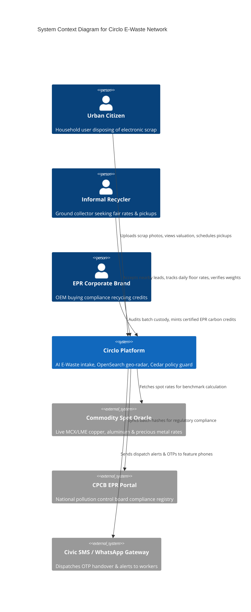
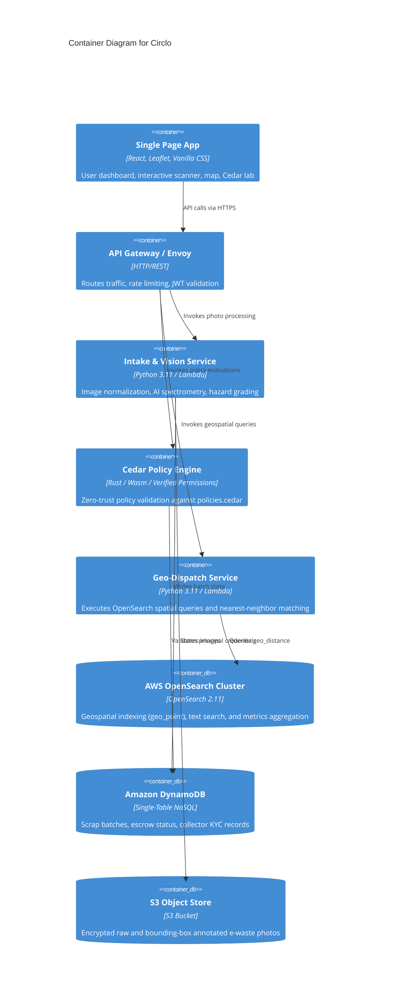
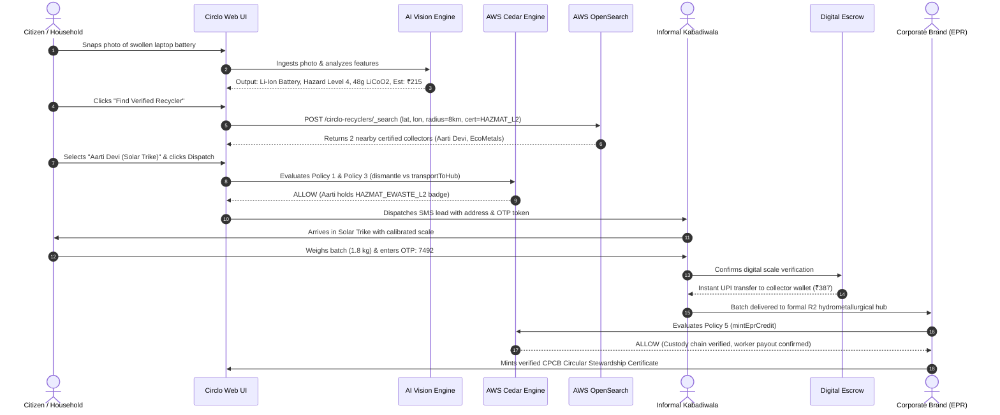
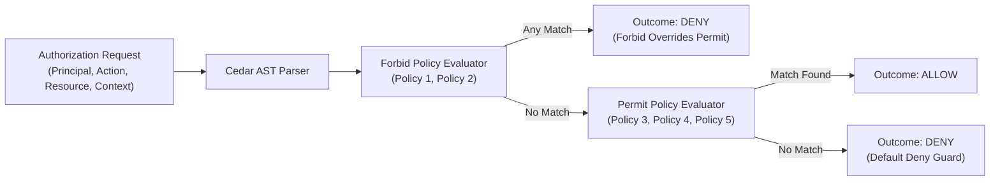

# 🏛️ Architecture & System Design Document — Circlo
**System Architecture:** Hybrid Decentralized Event-Driven Architecture  
**Target Runtimes:** LocalStack (Local Zero-Cost) & AWS Cloud (Production)  
**Security Standard:** AWS Well-Architected Framework (Sustainability & Security Pillars)  

---

## 1. C4 Architecture Specification

### 1.1 Context Diagram (Level 1)


---

### 1.2 Container Diagram (Level 2)


---

## 2. End-to-End Sequence Diagram: Lifecycle of an E-Waste Batch



---

## 3. Deep Dive: AWS OpenSearch Geospatial Subsystem

### 3.1 Spatial Indexing Architecture
1. **Coordinate Projection:** WGS 84 coordinate system (`EPSG:4326`) indexed into OpenSearch via `geo_point` fields.
2. **Spatial Data Structure:** OpenSearch utilizes **BKD-trees (Block Krylov Distance trees)** under Lucene for sub-millisecond range and radius traversals.
3. **Haversine Distance Metric:** Arc distance type (`arc`) calculated over the spherical earth model to deliver exact metric distance in kilometers.

### 3.2 Dynamic Spatial Clustering & Ward Aggregations
OpenSearch performs real-time geo-hash grid aggregation to show municipal authorities where e-waste recovery density is highest:
```json
{
  "aggs": {
    "zones": {
      "geohash_grid": {
        "field": "location",
        "precision": 6
      },
      "aggs": {
        "total_gold_grams": {
          "sum": { "field": "recovered_gold_g" }
        }
      }
    }
  }
}
```

---

## 4. Deep Dive: AWS Cedar Policy Engine Subsystem



### 4.1 Strict Cedar Security Invariants
1. **Default Deny:** Unless an explicit `permit` policy evaluates to `true`, authorization is denied.
2. **Forbid Precedence:** A single matching `forbid` statement immediately terminates authorization in `DENY`, regardless of any `permit` rules.
3. **Formal Verification:** Cedar policies are mathematically verifiable using automated reasoning (SMT solvers) to prove absence of security regressions.

---

## 5. Privacy, PII & Data Protection

- **Spatial Obfuscation:** Citizen home coordinates are fuzzed by $\pm 250\text{ meters}$ during public search queries until a pickup lead is officially accepted by a KYC-verified collector.
- **Phone Masking:** Resident contact numbers are never exposed in plaintext; SMS and call relays occur through automated virtual numbers.
- **Audit Immutability:** Every scrap batch creation and handover is cryptographically signed with SHA-256 hashes containing `(citizen_id, batch_id, weight_kg, timestamp)`.
