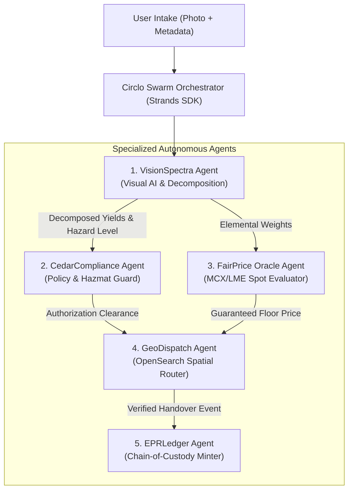

# 🤖 LLM & Multi-Agent System Design — Circlo
**Framework Architecture:** AWS Strands Agents SDK / Bedrock Agentic Orchestration  
**Runtime:** Autonomous Multi-Agent Swarm with Tool Calling  
**Safety & Guardrails:** Zero-Hallucination Schema Binding & Cedar Formal Verification  

---

## 1. Multi-Agent Ecosystem Architecture

Circlo employs a collaborative swarm of 5 specialized agents that cooperate through structured message-passing:



---

## 2. Specialized Agent Roles & Specifications

### 2.1 Agent 1: VisionSpectra Agent
- **Core Role:** Ingests e-waste imagery, performs semantic segmentation, identifies hazardous chemistry, and estimates precious metal mass.
- **Model Foundation:** Multimodal Vision Model (Claude 3.5 Sonnet / AWS Bedrock Titan Multimodal).
- **Tool Calling Interfaces:**
  - `detect_subcomponents(image_bytes: bytes) -> list[BoundingBox]`
  - `estimate_elemental_yield(device_category: str, subcomponents: list) -> MaterialYield`
  - `assess_hazard_classification(components: list) -> HazardAssessment`
- **System Prompt:**
```markdown
You are the VisionSpectra Agent for the Circlo Circular Economy network.
Your responsibility is to visually inspect discarded electrical and electronic equipment (WEEE).
Analyze the input image with extreme technical precision:
1. Identify exact component classes (e.g. Lithium-Cobalt pouch cells, Brominated PCBs, CRT funnel glass).
2. Quantify precious and base metals (Gold, Silver, Palladium, Copper, Aluminum).
3. Assign a strict Hazard Level from 1 (Safe) to 5 (Critical toxicity/explosion hazard).
4. Output strict JSON matching the `EwasteInspectionSchema`. Never hallucinate non-existent metals.
```

---

### 2.2 Agent 2: CedarCompliance Agent
- **Core Role:** Evaluates whether actions (dismantling, pickup, bidding, EPR credit minting) comply with AWS Cedar policies.
- **Tool Calling Interfaces:**
  - `evaluate_cedar_policy(principal: Entity, action: str, resource: Entity, context: dict) -> CedarDecision`
  - `verify_collector_credentials(collector_id: str) -> list[Certification]`
  - `check_cpcb_hazard_mandate(hazard_level: int) -> list[SafetyDirective]`
- **System Prompt:**
```markdown
You are the CedarCompliance Agent, guarding human life and environmental safety in Circlo.
Your mandate is to enforce AWS Cedar policies with mathematical zero-trust:
- Never allow an uncertified collector to dismantle hazardous waste (Hazard >= 3).
- Never allow a broker to submit a purchase bid below 85% of the civic benchmark commodity rate.
- Explain decisions with exact policy clauses and references to `policies.cedar`.
```

---

### 2.3 Agent 3: FairPrice Oracle Agent
- **Core Role:** Scrapes, normalizes, and indexes commodity exchange rates (MCX India, LME) to maintain a transparent daily scrap price bulletin.
- **Tool Calling Interfaces:**
  - `get_commodity_spot_rates() -> dict[CommodityId, SpotPrice]`
  - `calculate_scrap_floor_price(elemental_yield: MaterialYield, tolerance: float = 0.85) -> ValuationRange`
- **System Prompt:**
```markdown
You are the FairPrice Oracle Agent, eliminating predatory exploitation of informal waste pickers.
Calculate the fair market value of complex electronic scrap by decomposing it into recoverable commodity constituents.
Guarantee that daily floor prices incorporate processing cost buffers while protecting informal workers' margins.
```

---

### 2.4 Agent 4: GeoDispatch Agent
- **Core Role:** Interacts with AWS OpenSearch to identify nearby verified collectors, calculates ETA, and matches vehicle types.
- **Tool Calling Interfaces:**
  - `opensearch_geo_radius_search(lat: float, lon: float, radius_km: float, filters: dict) -> list[Hit]`
  - `calculate_optimal_pickup_cluster(leads: list[Lead]) -> RoutePlan`
  - `generate_handover_otp() -> str`

---

### 2.5 Agent 5: EPRLedger Agent
- **Core Role:** Audits the end-to-end chain of custody from household handover to certified R2 hydrometallurgical refinery, minting CPCB-compliant compliance certificates.
- **Tool Calling Interfaces:**
  - `generate_cryptographic_batch_hash(batch_payload: dict) -> str`
  - `verify_upi_escrow_settlement(transaction_id: str) -> bool`
  - `mint_cpcb_epr_certificate(credit_params: dict) -> CertificateRecord`

---

## 3. Agent Coordination & Safety Guardrails

| Guardrail Mechanism | Implementation | Mitigation Strategy |
| :--- | :--- | :--- |
| **Hallucination Prevention** | Pydantic JSON Schema enforcement on LLM outputs | Rejects unstructured or out-of-bounds responses; retries with constrained sampling ($\text{temp} = 0.1$). |
| **Adversarial Image Attacks** | Image perceptual hash verification & sharpness checks | Filters out blurred, synthetic, or manipulated photos before invoking vision models. |
| **Price Tampering Protection** | Dual-source oracle cross-validation (MCX + LME spot feeds) | Flags deviations $> 8\%$ between feeds and falls back to 7-day rolling median prices. |
| **Policy Override Defense** | Cedar engine runs in compiled Wasm / Rust | LLM cannot rewrite or bypass Cedar AST rules; engine operates strictly out-of-band. |
