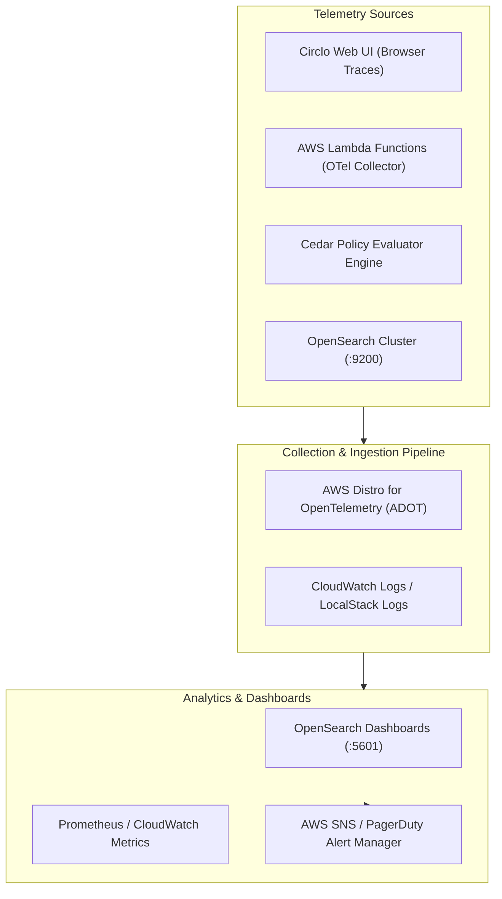
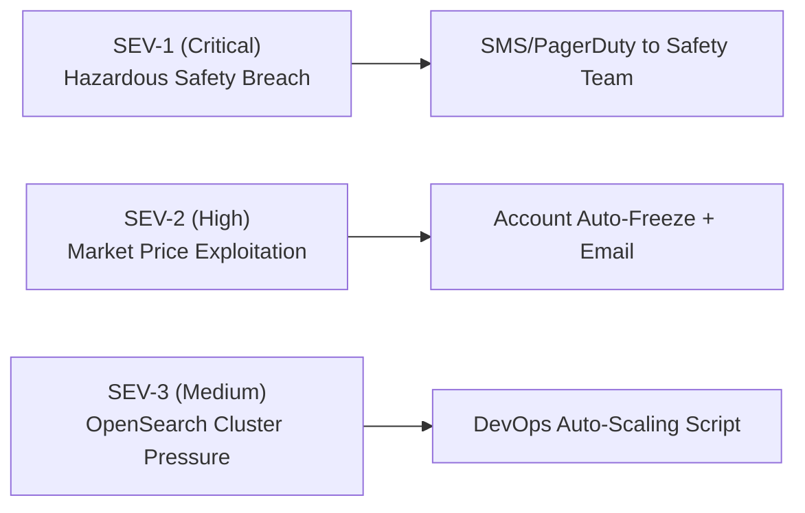

# 📊 Monitoring, Observability & Reliability Guide — Circlo
**Observability Standard:** OpenTelemetry (OTel) + AWS CloudWatch / OpenSearch Dashboards  
**Target Availability:** 99.95% (Production SLO)  
**Security Monitoring:** Zero-Trust Audit Logs & Real-Time Hazmat Violation Alerting  

---

## 1. Observability Architecture (The Three Pillars)



---

## 2. Key Service Level Objectives (SLOs) & Critical Metrics

| Metric Name | Target SLO | Metric Type | Alarm Threshold | Action Runbook |
| :--- | :--- | :--- | :--- | :--- |
| **OpenSearch Geo Query Latency** | $\text{p95} < 50\text{ ms}$ | Latency (Histogram) | $> 120\text{ ms}$ for 3 mins | Scale search replicas; verify BKD-tree indexing on `location`. |
| **Cedar Policy Evaluation Time** | $\text{p99} < 1\text{ ms}$ | Latency (Summary) | $> 5\text{ ms}$ for 1 min | Check AST complexity; verify in-memory policy cache. |
| **AI Vision Classification Success** | $\ge 99.5\%$ | Availability (Counter) | Failure rate $> 1.0\%$ | Trigger fallback vision model; alert model service team. |
| **Hazardous Dismantling Violations** | $0\text{ Events}$ | Security (Counter) | $\ge 1\text{ Event}$ (Instant) | **SEV-1 Alert:** Block collector account; dispatch safety inspector. |
| **Broker Price Undercut Attempts** | $< 0.1\%$ | Compliance (Counter) | $\ge 3\text{ Bids} < 85\%$ | **SEV-2 Alert:** Auto-suspend broker from submitting bids on Circlo. |

---

## 3. Real-Time Alerting Matrix & Escalation Matrix

### 3.1 Severity Levels



#### Alert Rule 1: `HazardousEwasteBypassAttempt` (SEV-1)
- **Condition:** `cedar_eval_result{policy="policy_hazard_dismantling_guard", decision="DENY"} > 0`
- **Description:** An uncertified collector attempted to initiate unauthorized manual dismantling of a Class 3, 4, or 5 hazardous batch (e.g. swollen Li-ion pouch cell or CRT leaded glass).
- **Automated Mitigation:** Immediate batch quarantine in DynamoDB (`status = "FROZEN_HAZMAT_INVESTIGATION"`). Collector app locked into read-only safety mode.

#### Alert Rule 2: `PredatoryPriceGougingDetected` (SEV-2)
- **Condition:** `sum_over_time(cedar_eval_result{policy="policy_fair_floor_price_guarantee", decision="DENY"}[15m]) >= 3`
- **Description:** A registered scrap broker or aggregator repeatedly submitted purchase bids below the 85% civic commodity floor threshold.
- **Automated Mitigation:** Broker's bidding permissions revoked for 48 hours; civic fair trade committee notified.

---

## 4. OpenSearch Dashboards & Visualization Panels

Circlo configures 4 default operational dashboards in OpenSearch Dashboards (`http://localhost:5601` or Amazon OpenSearch):

1. **Civic E-Waste Heatmap:** Real-time geo-point map tracking e-waste intake density across municipal wards, overlaid with active EV cargo rickshaw locations.
2. **Material Recovery Stream:** Stacked bar chart showing kilograms of reclaimed Gold, Silver, Copper, Lithium, and Aluminum recovered daily.
3. **Cedar Policy Execution Audit:** Pie chart of policy outcomes (`ALLOW` vs. `DENY` breakdowns) with latency distributions.
4. **Informal Worker Welfare Index:** Time-series graph comparing average payouts received by informal recyclers vs. baseline unorganized scrap prices (+38.5% uplift).

---

## 5. Structured Audit Logging Schema

Every critical state change emits a structured JSON audit event:
```json
{
  "timestamp": "2026-10-09T13:30:00.042Z",
  "event_type": "CEDAR_AUTHORIZATION_EVALUATED",
  "event_id": "evt_7f9b81a2",
  "principal": {
    "type": "Recycler",
    "id": "rec_101",
    "kyc_verified": true,
    "certifications": ["SAFE_SORT"]
  },
  "action": "Action::\"dismantle\"",
  "resource": {
    "type": "ScrapBatch",
    "id": "batch_881",
    "category": "LITHIUM_ION_BATTERY",
    "hazard_level": 4
  },
  "decision": "DENY",
  "matched_forbids": ["policy_hazard_dismantling_guard"],
  "matched_permits": [],
  "evaluation_latency_ms": 0.042,
  "client_ip_hash": "e3b0c44298fc1c149afbf4c8996fb924",
  "geo_ward": "Delhi_Ward_04"
}
```
