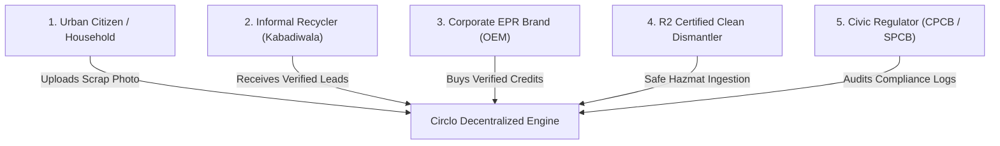

# 📋 Product Requirements Document (PRD) — Circlo (सर्कलो)
**Product Name:** Circlo  
**Track:** Track 03 — Waste & Energy  
**Sub-themes:** E-waste, Informal Recyclers, Segregation, Recycling, Rooftop Solar / Energy Nudges  
**Version:** 1.0.0 (Production Blueprint)  
**Status:** Approved for Architecture & Implementation  

---

## 1. Executive Summary & Vision

### 1.1 Vision Statement
To formalize and dignify urban informal e-waste recycling through decentralized AI, geospatial matching, and automated safety/pricing policies—transforming the hazardous informal scrap trade into a safe, transparent, and digitally verified circular economy.

### 1.2 The Problem Landscape
- **1.5M+ Informal Workers (*Kabadiwalas*):** Process >90% of e-waste across India and developing economies without protective equipment or fair access to markets.
- **Backyard Toxic Dismantling:** Open-air burning of PCBs for copper and backyard acid leaching of gold releases dioxins, furans, and lead into urban air and groundwater tables.
- **Predatory Intermediaries:** Scrap cartels exploit informal pickers using rigged mechanical scales and unlisted prices, paying <₹20/kg for circuit boards worth >₹150/kg.
- **Urban Household Friction:** Citizens hoard obsolete electronics (swollen batteries, dead phones, chargers) in homes due to lack of trusted disposal channels.
- **EPR Compliance Failure:** Electronics manufacturers (OEMs) face strict Central Pollution Control Board (CPCB) Extended Producer Responsibility (EPR) mandates but lack auditable supply chain custody to formalize informal scrap.

### 1.3 Circlo Value Proposition
Circlo connects households directly to verified informal recyclers via **AWS OpenSearch** geospatial matching, verifies device chemistry via **Multimodal Vision AI**, enforces safety and floor pricing through **AWS Cedar**, and mints auditable **EPR compliance certificates**.

---

## 2. User Personas & Stakeholder Analysis

### Persona 1: Citizen / Household Disposer (Priya, 32, Bengaluru)
- **Goal:** Safely dispose of old electronics, understand their fair residual value, and avoid landfill pollution.
- **Pain Point:** Doesn't trust roadside dealers, local municipal bins mix wet and electronic waste.

### Persona 2: Informal Recycler / Collector (Ram Lakhan, 44, Delhi NCR)
- **Goal:** Earn a predictable, dignified daily livelihood without getting cheated by wholesale scrap aggregators.
- **Pain Point:** Exposed to toxic chemical fumes, lacks safety equipment, operates with cash without credit access.

### Persona 3: Electronics OEM / EPR Compliance Head (Vikram, 48, Mumbai)
- **Goal:** Fulfill mandatory CPCB annual e-waste recycling quotas with tamper-evident digital proof of custody.
- **Pain Point:** Fake paper recycling invoices, lack of end-to-end tracing back to informal collection source.

### Persona 4: Certified R2 / Hydrometallurgical Hub (EcoMetals Ltd)
- **Goal:** Ingest high-grade aggregated scrap batches (PCBs, lithium black mass) from verified collectors at scale.
- **Pain Point:** Unsorted batches contaminated with non-recyclables and hazardous components.

---

## 3. Product Scope & Functional Requirements (FR)

### FR-1: Multimodal AI Vision & Spectral Material Valuator
- **FR-1.1:** System shall ingest user-uploaded images or live camera streams of electronic devices.
- **FR-1.2:** System shall classify the device category into one of 12 predefined e-waste taxonomies (`LITHIUM_ION_BATTERY`, `PRINTED_CIRCUIT_BOARDS`, `COPPER_WINDINGS`, `CRT_MONITOR`, `POWER_ELECTRONICS`, `PHOTOVOLTAIC_MICROINVERTER`, etc.).
- **FR-1.3:** System shall detect subcomponents with bounding box coordinates and confidence ratings ($\ge 85\%$).
- **FR-1.4:** System shall compute estimated elemental yields: Gold ($Au$), Silver ($Ag$), Copper ($Cu$), Lithium ($Li$), Cobalt ($Co$), Aluminum ($Al$), and Lead ($Pb$).
- **FR-1.5:** System shall determine Hazard Classification Level from 1 (Low/Safe) to 5 (Critical/Severe Toxicity).
- **FR-1.6:** System shall fetch live commodity spot rates (MCX/LME linked) and display the guaranteed minimum fair market valuation range.

### FR-2: Hyperlocal Civic Recycler Radar (AWS OpenSearch Geospatial)
- **FR-2.1:** System shall index collector coordinates using OpenSearch `geo_point` field types.
- **FR-2.2:** System shall query available verified collectors within a user-defined radius (1 km to 25 km) using `geo_distance` filters.
- **FR-2.3:** System shall support material specialization filtering (e.g., only show collectors certified for `HAZMAT_EWASTE_L2` when disposing of swollen lithium batteries).
- **FR-2.4:** System shall expose the exact OpenSearch Query DSL in an inspection panel for auditability and developer transparency.

### FR-3: AWS Cedar Policy Engine & Safety Guardrails
- **FR-3.1:** System shall evaluate all scrap handling actions through declarative AWS Cedar policies.
- **FR-3.2:** **Policy 1 (Hazard Guard):** Automatically forbid dismantling or chemical extraction for scrap with Hazard Level $\ge 3$ unless principal holds `HAZMAT_EWASTE_L2` or `R2_CERTIFIED`.
- **FR-3.3:** **Policy 2 (Anti-Gouging Floor Price):** Automatically forbid any purchase bid from aggregators to informal collectors that is $< 85\%$ of the civic commodity benchmark index.
- **FR-3.4:** **Policy 3 (Safe Pickup Permit):** Permit verified KYC collectors to accept safe segregated scrap (Hazard $\le 2$).
- **FR-3.5:** **Policy 5 (EPR Credit Validation):** Permit brands to mint EPR credits only when chain of custody proof, geo-trace, and digital worker payout confirmation exist.

### FR-4: Kabadiwala Empowerment & Welfare Hub
- **FR-4.1:** Display live daily civic floor rates with 24-hour trend indicators.
- **FR-4.2:** Dispatch real-time pickup leads to registered collectors within their active zone with navigation routes and guaranteed payouts.
- **FR-4.3:** Provide a 3-tier safety certification progression pathway (Safe Sort KYC $\rightarrow$ Hazmat L2 $\rightarrow$ R2 Hub Franchise).
- **FR-4.4:** Enforce a digital weighing scale escrow with dual-key OTP verification (preventing scale manipulation).

### FR-5: EPR Impact Ledger & Circular Certificate Minting
- **FR-5.1:** Dynamically aggregate environmental diversion metrics:
  - Total e-waste diverted from dumpsites (kg)
  - Toxic lead & mercury prevented from entering groundwater (Liters)
  - Net $\text{CO}_2$ emissions abated vs. virgin raw ore mining (kg $\text{CO}_2e$)
  - Informal worker income uplift percentage
- **FR-5.2:** Generate printable/downloadable CPCB-compliant Circular Stewardship Certificates with immutable cryptographic batch hashes and QR verification.

---

## 4. Non-Functional Requirements (NFR)

| ID | Category | Requirement Specification |
| :--- | :--- | :--- |
| **NFR-1** | **Performance & Latency** | Vision inference $\le 1.2\text{s}$; OpenSearch geo-query $\le 50\text{ms}$; Cedar policy evaluation $\le 5\text{ms}$. |
| **NFR-2** | **Zero-Cloud Portability** | 100% executable locally via LocalStack, Finch/Docker, and OpenSearch with zero mandatory AWS bill ("Build It" track). |
| **NFR-3** | **Security & Privacy** | Citizen phone numbers masked via virtual dispatch routing; Cedar policy denials logged immutably. |
| **NFR-4** | **Availability & Resilience** | Graceful degradation: in-browser mock engine fallback if local OpenSearch daemon is offline. |
| **NFR-5** | **Accessibility & Localization** | Support high-contrast dark theme, touch-friendly mobile layouts, and Hindi/English bilingual typography. |

---

## 5. Success Metrics & Key Performance Indicators (KPIs)

1. **Environmental Diversion:** $\ge 500\text{ kg}$ e-waste collected per ward per month.
2. **Worker Welfare:** $\ge 35\%$ average monthly income uplift for informal collectors.
3. **Safety Compliance:** $0\%$ unauthorized backyard acid burns for batches transacted through Circlo.
4. **Price Fairness:** $100\%$ transactions compliant with Cedar 85% commodity floor pricing rule.
5. **EPR Integrity:** $100\%$ minted compliance certificates traceable to verified collector digital wallet transactions.
