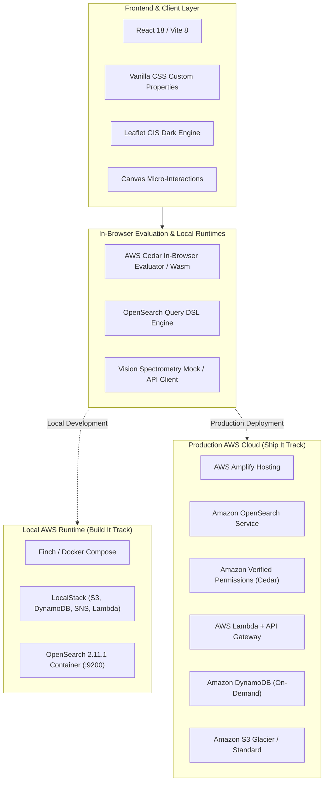

# ⚙️ Technical Requirements Document (TRD) — Circlo
**Document Version:** 1.0.0  
**Target Tracks:** AWS Open Source ("Build It") & Cloud Deployment ("Ship It")  
**Compliance Standard:** ISO 14001, CPCB E-Waste (Management) Rules 2022  

---

## 1. System Technology Stack



---

## 2. Data Models & Schemas

### 2.1 Amazon DynamoDB Single-Table Design (`circlo-core-ledger`)

| Entity Type | Partition Key (`PK`) | Sort Key (`SK`) | GSI1-PK | GSI1-SK | Attributes |
| :--- | :--- | :--- | :--- | :--- | :--- |
| **Collector Profile** | `COLLECTOR#<id>` | `PROFILE` | `ZONE#<city>` | `RATING#<score>` | `name, phone, kycVerified, certifications, vehicleType, location` |
| **Scrap Batch Intake**| `BATCH#<id>` | `METADATA` | `USER#<citizenId>` | `TIMESTAMP#<iso>` | `category, hazardLevel, weightKg, estPayout, status, photoHash` |
| **Pickup Dispatch**   | `DISPATCH#<id>` | `STATUS` | `COLLECTOR#<id>` | `STATUS#<status>` | `batchId, citizenId, collectorId, otpCode, escrowAmount, timestamp` |
| **EPR Credit**        | `EPR#<creditId>`| `CERTIFICATE` | `BRAND#<brandId>` | `TIMESTAMP#<iso>` | `batchId, cpcbRef, co2KgSaved, goldGrams, chainOfCustodyProof` |

### 2.2 AWS OpenSearch Index Schema (`circlo-recyclers`)
```json
{
  "settings": {
    "index": {
      "number_of_shards": 2,
      "number_of_replicas": 1,
      "analysis": {
        "analyzer": {
          "ewaste_analyzer": {
            "type": "custom",
            "tokenizer": "standard",
            "filter": ["lowercase", "stop", "snowball"]
          }
        }
      }
    }
  },
  "mappings": {
    "properties": {
      "recycler_id": { "type": "keyword" },
      "name": { "type": "text", "analyzer": "ewaste_analyzer" },
      "phone": { "type": "keyword", "index": false },
      "collector_type": { "type": "keyword" },
      "kyc_verified": { "type": "boolean" },
      "fair_price_pledge": { "type": "boolean" },
      "certifications": { "type": "keyword" },
      "vehicle_type": { "type": "keyword" },
      "rating": { "type": "float" },
      "total_batches_collected": { "type": "integer" },
      "location": { "type": "geo_point" },
      "operating_radius_km": { "type": "float" },
      "accepted_materials": { "type": "keyword" },
      "status": { "type": "keyword" },
      "updated_at": { "type": "date" }
    }
  }
}
```

### 2.3 AWS Cedar Schema (`schema.cedarschema`)
```cedar
entity User;
entity Recycler in [User] = {
    kycVerified: Boolean,
    certifications: Set<String>,
    walletBalance: Long,
    collectorTier: String
};

entity Aggregator in [User] = {
    licenseId: String,
    complianceScore: Long
};

entity EprBrand in [User] = {
    isRegisteredBrand: Boolean,
    cpcbRegistrationNo: String
};

entity ScrapBatch = {
    hazardLevel: Long,
    category: String,
    sellerType: String,
    weightKg: Decimal,
    status: String,
    hasChainOfCustodyProof: Boolean,
    informalCollectorPayoutConfirmed: Boolean
};

action "dismantle" appliesTo {
    principal: [Recycler, Aggregator],
    resource: [ScrapBatch]
};

action "submitPurchaseBid" appliesTo {
    principal: [Aggregator],
    resource: [ScrapBatch],
    context: {
        offeredPricePerKg: Decimal,
        benchmarkPricePerKg: Decimal
    }
};

action "mintEprCredit" appliesTo {
    principal: [EprBrand],
    resource: [ScrapBatch]
};
```

---

## 3. Core API Specifications

### 3.1 OpenSearch Geospatial Search API
- **Endpoint:** `POST /circlo-recyclers/_search`
- **Payload:**
```json
{
  "query": {
    "bool": {
      "must": [
        { "term": { "status": "AVAILABLE" } },
        { "term": { "kyc_verified": true } }
      ],
      "filter": {
        "geo_distance": {
          "distance": "8km",
          "location": { "lat": 28.6139, "lon": 77.2090 }
        }
      }
    }
  },
  "sort": [
    {
      "_geo_distance": {
        "location": { "lat": 28.6139, "lon": 77.2090 },
        "order": "asc",
        "unit": "km",
        "distance_type": "arc"
      }
    }
  ]
}
```

### 3.2 Cedar Policy Authorization Check API
- **Protocol:** In-Browser Engine / AWS Verified Permissions REST API
- **Request Body:**
```json
{
  "principal": { "entityType": "Recycler", "entityId": "rec_101" },
  "action": { "actionType": "Action", "actionId": "dismantle" },
  "resource": { "entityType": "ScrapBatch", "entityId": "batch_881" },
  "context": {
    "offeredPricePerKg": 750,
    "benchmarkPricePerKg": 890
  }
}
```
- **Response Format:**
```json
{
  "decision": "DENY",
  "diagnostics": {
    "reason": ["policy_hazard_dismantling_guard"],
    "errors": []
  },
  "evaluationTimeMs": 0.042
}
```

---

## 4. Latency Budget & SLA Definitions

```mermaid
gantt
    title End-to-End Scrap Intake & Dispatch Latency Budget (Target: < 2000 ms)
    dateFormat X
    axisFormat %s ms
    section Pipeline
    Client Image Capture & Preprocessing : 0, 250
    Vision AI Classification & Feature Extraction : 250, 1050
    Cedar Safety Policy Authorization Check : 1050, 1090
    OpenSearch Geospatial Radar Query : 1090, 1200
    UI Render & Map Marker Projection : 1200, 1350
```



- **Target Response Time (p95):** $\le 1500\text{ ms}$
- **Cedar Policy Evaluation:** $\le 1\text{ ms}$
- **OpenSearch Geospatial Query:** $\le 45\text{ ms}$
- **Cold-Start Tolerance (Serverless):** $\le 800\text{ ms}$ (Provisioned Concurrency optional)
